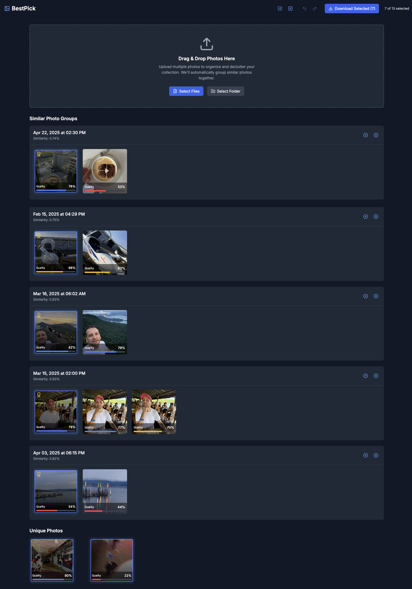

# BestPick 📸✨

A React application designed to help you declutter and organize your photo collections by grouping similar images and scoring their quality. Everything happens locally.

https://bestpick.plhery.com/


_(This project was mostly AI vibe-coded)_

## Features

*   **Upload Photos:** Easily upload individual photos or entire folders.
*   **Similarity Grouping:** Automatically groups visually similar photos together using CLIP embeddings (via Transformers.js).
*   **Quality Scoring:** Assigns a quality score to each photo based on CLIP analysis against positive and negative prompts.
*   **Best Photo Suggestion:** Highlights the photo with the highest quality score within each group.
*   **Unique Photo Display:** Shows photos that don't belong to any similarity group.
*   **Selection & Download:** Select the photos you want to keep (defaults to unique photos and the best from each group) and download them.

## Getting Started

1.  **Clone the repository:**
    ```bash
    git clone git@github.com:PLhery/BestPick.git
    cd BestPick
    ```

2.  **Install dependencies:**
    ```bash
    npm install
    # or
    yarn install
    ```

3.  **Run the development server:**
    ```bash
    npm run dev
    # or
    yarn dev
    ```

    The application should now be running on `http://localhost:5173` (or another port if 5173 is busy).

## How it Works

1.  **Upload:** Users upload image files.
2.  **Feature Extraction:** The application uses a CLIP vision model (`jinaai/jina-clip-v1`) via Transformers.js to generate embeddings (numerical representations) for each image.
3.  **Quality Scoring:** Embeddings for predefined positive ("high quality", "sharp", etc.) and negative ("blurry", "dark", etc.) text prompts are generated using a CLIP text model. The image embedding's cosine similarity to these prompt embeddings is used to calculate a 0-100 quality score.
4.  **Grouping:** Images are compared based on the cosine similarity of their embeddings. Photos with similarity above a certain threshold (e.g., 0.7) are grouped together.
5.  **Display:** The UI displays grouped photos (sorted by quality) and unique photos separately.
6.  **Selection:** Users can select/deselect photos. By default, unique photos and the highest-quality photo from each group are selected.
7.  **Download:** Selected photos can be downloaded.